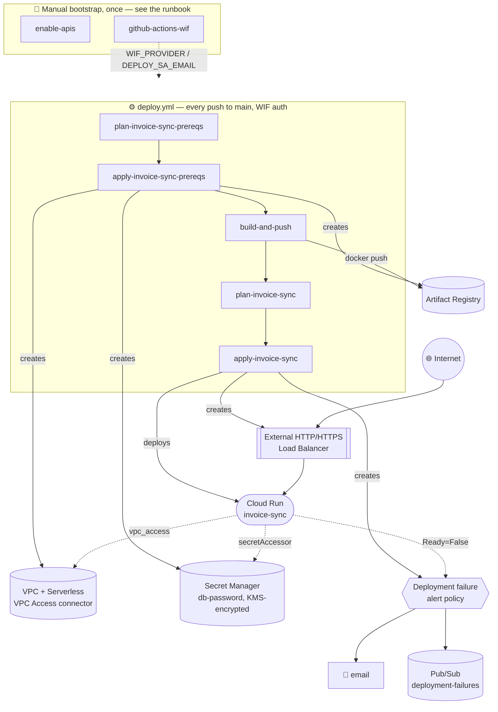

# 🚀 terraform-cloud-run-invoice-sync

Terraform for the `invoice-sync` Cloud Run service in `yeti-504903`: the service, its runtime
SA, a keyless GitHub Actions deploy identity (WIF), a public load balancer as the only entry
point, and email alerting on failed deploys.

📖 **Setup**: [`docs/bootstrap-runbook.md`](docs/bootstrap-runbook.md) — copy-pasteable
commands for every manual step, in order.
📚 **Design rationale**: [`CLAUDE.md`](CLAUDE.md) — the *why* behind every non-obvious choice
(IAM scoping, alerting gotchas, module structure rules).

## 🏗️ Architecture



- ✋ `enable-apis` and `github-actions-wif` are the **only** stacks ever applied by hand.
- 🔁 Everything else — `artifact-registry`, `network`, `db-secrets`, `invoice-sync` — is applied
  by the pipeline, every push, split into a `plan` job (saves a `tfplan` artifact) and an
  `apply` job (applies that exact artifact, no re-plan).

## 🧰 Local usage

```bash
task                             # list tasks
ACTION=plan task invoice-sync    # init + plan (default ACTION)
ACTION=apply task invoice-sync   # init + apply
```

- 🌍 `PROJECT_ID`/`STATE_BUCKET` default to `yeti-504903`/`yeti-terraform-state-bucket`,
  overridable via env: `PROJECT_ID=other-project STATE_BUCKET=other-bucket task invoice-sync`.
- 🏷️ `invoice-sync`'s `image_tag` has no default — pass it explicitly:
  `task invoice-sync -- -var image_tag=<git-sha>`.

## 📁 Layout

```
modules/                     reusable building blocks — one concern each, no state of their own
├── enable-apis/             wraps google_project_service, generic across projects
├── artifact-registry/       wraps google_artifact_registry_repository
├── secret-manager-secret/   secret container only, never a version — the value never lands
│                            in Terraform state
├── cloud-run/                the service, its runtime SA, and per-secret access grants
│                            (copied from defyjoy/google-cloud-terraform, unchanged)
├── github-actions-wif/       WIF pool + provider + deploy SA, scoped to one repo, plus its
│                            nine per-service custom IAM roles
├── deployment-failure-alert/ Pub/Sub topic + email/Pub/Sub notification channels + a
│                            log-based alert policy
└── serverless-lb/            the public HTTP(S) load balancer in front of Cloud Run
                             (copied from defyjoy/google-cloud-terraform, unchanged)

live/                        root stacks — one state file per directory, composes modules only
├── enable-apis/              service APIs this repo's stacks need — bootstrap, manual
├── github-actions-wif/       the deploy identity — bootstrap, manual, applied once
├── artifact-registry/        the invoice-sync image repo — pipeline-applied, ahead of push
├── network/                  this repo's own VPC + connector — pipeline-applied, ahead of
│                            invoice-sync
├── db-secrets/                the db-password secret container — pipeline-applied, ahead of
│                            invoice-sync
└── invoice-sync/             the service, load balancer, and failure alerting — the stack
                             everything else exists to support

docs/
└── bootstrap-runbook.md      every manual step, as copy-pasteable commands, in order

.github/
└── workflows/
    └── deploy.yml            the five-job plan/apply pipeline (see the diagram above)

app/                          placeholder Node.js server proving the pipeline end to end
```

- 🗄️ Each `live/*` directory holds separate Terraform state:
  `gs://yeti-terraform-state-bucket/yeti-504903/live/<stack-name>`.
- 🚫 `live/*` root modules only compose modules — no raw `resource` blocks. A new resource
  belongs in the `modules/*` that owns its concern.

## 🔒 Networking

- 🚪 Cloud Run's `ingress` is internal-only — the load balancer (`modules/serverless-lb`) is the
  sole public entry point.
- ➡️ Egress routes through a dedicated Serverless VPC Access connector in this repo's own VPC
  (`live/network`), not `google-cloud-terraform`'s shared hub.
- 🌐 No VPN — the load balancer is public by design (see CLAUDE.md's Networking section for the
  no-exceptions rule this repo follows).

## 📦 App source

`app/` is a placeholder Node.js server (`GET /`, `GET /healthz`, `GET /readyz`) — enough to
prove the pipeline and the failure-alerting path end to end. Swap in the real service without
touching the `Dockerfile`, as long as it listens on `$PORT` (8080 default).
